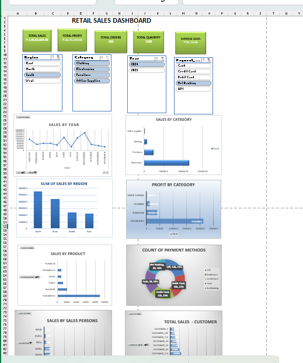

# Retail-Sales-Dashboard-using-excel
Interactive Retail Sales Dashboard built in Microsoft Excel using Pivot Tables, Charts, Slicers, KPI Cards, and Data Analysis.
# Retail Sales Dashboard

## Project Overview

Interactive Retail Sales Dashboard created using Microsoft Excel to analyze sales performance, profit trends, category analysis, regional performance and customer insights.

## Tools Used

- Microsoft Excel
- Pivot Tables
- Pivot Charts
- Slicers
- Conditional Formatting
- Data Analysis

## Dashboard Features

- Total Sales KPI
- Total Profit KPI
- Total Orders KPI
- Total Quantity KPI
- Average Sales KPI

## Visualizations

- Sales Trend Analysis
- Sales by Category
- Sales by Region
- Profit by Category
- Payment Method Analysis
- Sales Person Performance
- Customer Sales Analysis

## Dashboard Preview

## Key Insights

- Identified top performing categories
- Compared regional sales performance
- Analyzed profit contribution
- Studied customer purchasing behaviour
- Evaluated payment method distribution

## Files

Retail_Sales_Dashboard.xlsx - Excel Dashboard file
https://github.com/jayanthi1432/Retail-Sales-Dashboard-using-excel/blob/main/Retail_Sales_Dashboard.xlsx
## Skills & Tools Used

- Microsoft Excel
- Data Analysis
- Data Analytics
- Pivot Tables
- Excel Dashboard
- Sales Dashboard
- Business Intelligence
- Data Visualization
- 
## Author
Jayanthi Surla
